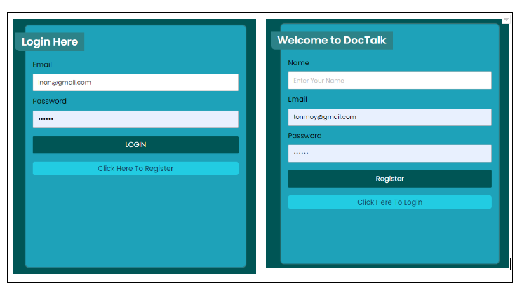
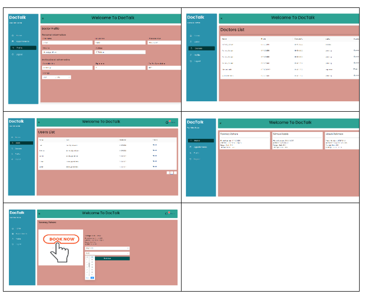

---

# DocTalk - Complete

DocTalk is a complete MERN web application that will allow patients and doctors to communicate online by staying at home. Multiple features in this application are like applying for the doctor, appointments, searching for doctors, notification, and approval from the admin. I have used HTML, CSS, JavaScript, React.js, Axios, Node.js, and MongoDB in this project.

 

